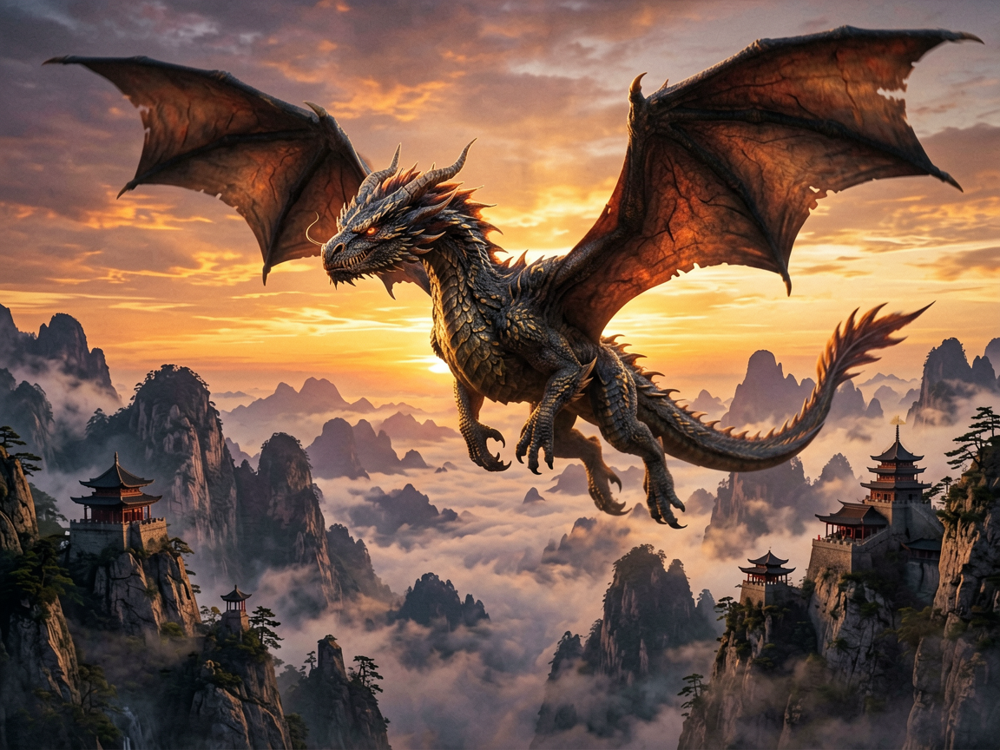
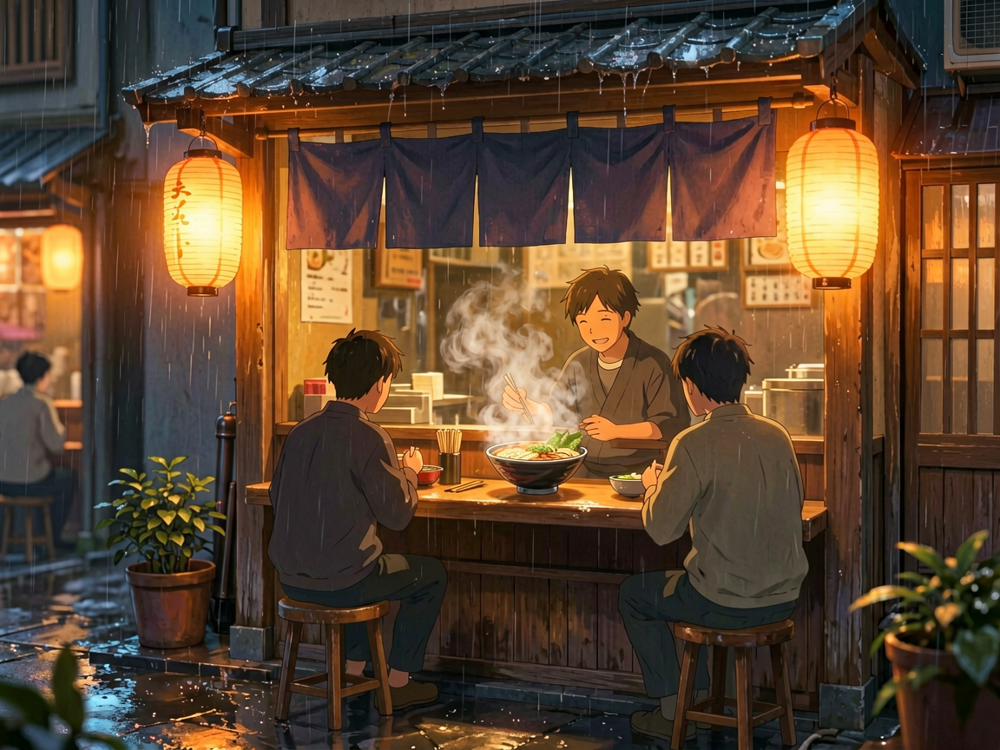

<div align="center">

# 🎨 Agnes AI MCP Server

**Free Text-to-Image & Text-to-Video generation via [Agnes AI](https://agnes-ai.com)**

[](https://pypi.org/project/agnes-mcp/)
[](https://pypi.org/project/agnes-mcp/)
[](https://github.com/MSWEIMZ/agnes-mcp/actions/workflows/ci.yml)
[](https://opensource.org/licenses/MIT)
[](https://www.python.org/downloads/)
[](https://modelcontextprotocol.io)

English | [中文](README_CN.md)

</div>

---

## 🚀 Quick Start

```bash
# 1. Install (one command)
pip install agnes-mcp

# 2. Get a free API key at https://agnes-ai.com

# 3. Add to your MCP client config:
```

**Claude Desktop / Cursor / Windsurf** (`claude_desktop_config.json` or equivalent):

```json
{
  "mcpServers": {
    "agnes-mcp": {
      "command": "uvx",
      "args": ["agnes-mcp"],
      "env": {
        "AGNES_API_KEY": "your-api-key-here"
      }
    }
  }
}
```

**Codex** (`config.toml`):

```toml
[mcp_servers.agnes_mcp]
command = "uvx"
args = ["agnes-mcp"]

[mcp_servers.agnes_mcp.env]
AGNES_API_KEY = "your-api-key-here"
```

That's it! Now you can generate images and videos directly from your AI assistant.

---

## ✨ Why Agnes MCP?

| Feature | Agnes MCP | Other AI Image Services |
|---------|-----------|------------------------|
| **Price** | **$0 / image, $0 / second** | $0.02 - $0.08 / image |
| Text-to-Image | ✅ 2 models (2.0 & 2.1 Flash) | ✅ Usually 1 model |
| Image-to-Image | ✅ Reference image + prompt | ❌ or limited |
| Batch Generation | ✅ 1-4 images at once | ❌ |
| Text-to-Video | ✅ Up to 18s, 1080p | ❌ or paid only |
| Image-to-Video | ✅ Static image → video | ❌ or paid only |
| Multi-image Video | ✅ Keyframe animation | ❌ |
| Auto Download | ✅ Saves locally automatically | ❌ Manual download |
| MCP Standard | ✅ Full compliance | Varies |

**Yes, it's completely free.** Agnes AI currently offers all image and video generation at $0. Just register and get an API key.

---

## 🖼️ Demo

### Text-to-Image (agnes-image-2.1-flash)

> *"A majestic dragon flying over a Chinese mountain landscape at sunset, cinematic lighting, epic fantasy art"*



### Text-to-Image (agnes-image-2.0-flash)

> *"A cozy Japanese ramen shop at night, warm lantern light, rain falling, anime style"*



---

## 📦 Tools

| Tool | Description | Example |
|------|-------------|---------|
| `text_to_image` | Generate image(s) from text | `prompt: "a cat"` + optional `n: 4`, `images: [ref_url]` |
| `image_to_image` | Generate from reference image(s) + text | `prompt: "make it cyberpunk"` + `images: [url]` |
| `text_to_video` | Generate video from text/image(s) | `prompt: "a cat dancing"` + optional `images: [urls]` |
| `check_video_status` | Check async video task status | `video_id: "xxx"` or `task_id: "xxx"` |

---

## ⚙️ Environment Variables

| Variable | Required | Default | Description |
|----------|----------|---------|-------------|
| `AGNES_API_KEY` | **Yes** | - | Your Agnes AI API key |
| `AGNES_API_BASE` | No | `https://apihub.agnes-ai.com/v1` | API base URL |
| `AGNES_DEFAULT_MODEL` | No | `agnes-image-2.1-flash` | Default image model |
| `AGNES_DEFAULT_SIZE` | No | `1024x768` | Default image size |

---

## 🔑 Get a Free API Key

1. Visit [https://agnes-ai.com](https://agnes-ai.com)
2. Create an account (free)
3. Go to Console → API Keys → Create
4. Copy the key and paste into your config

---

## ✅ Supported Clients

- [x] **Claude Desktop**
- [x] **Codex (OpenAI)**
- [x] **Cursor**
- [x] **Windsurf**
- [x] **Cherry Studio**
- [x] Any MCP client with `stdio` transport

---

## 📋 Changelog

### v0.2.0 (2026-06-27)
- ✨ New tool: `image_to_image` — generate from reference image(s) + prompt
- ✨ `text_to_image`: batch generation (`n: 1-4`) and multi-image composition (`images`)
- ✨ `text_to_video`: multi-image video / keyframe animation (`images`)
- 🐛 Unified multi-image download logic
- ✅ 19 tests passing

### v0.1.1 (2026-06-26)
- 🚀 Initial public release
- text_to_image, text_to_video, check_video_status
- Async httpx with retry mechanism
- Auto-download to local filesystem

---

## 🤝 Contributing

See [CONTRIBUTING.md](CONTRIBUTING.md) for guidelines.

---

## 📄 License

MIT